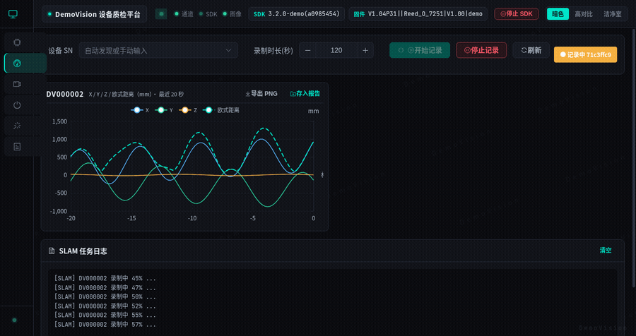
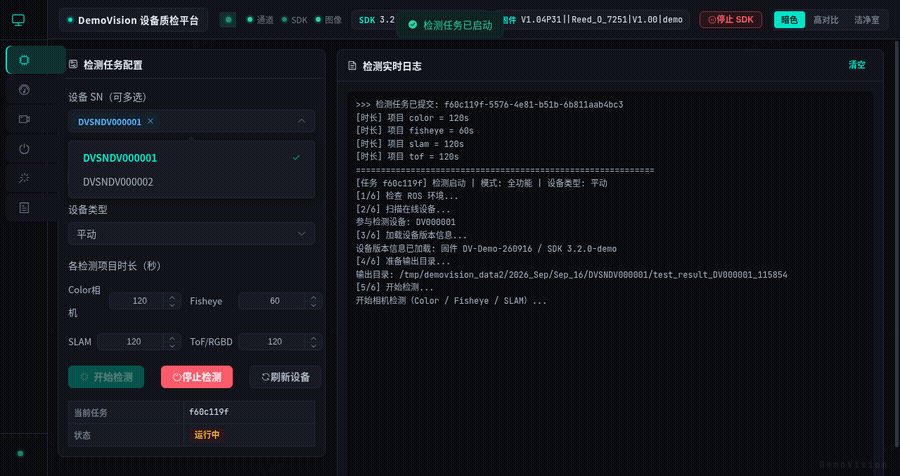

# DemoVision 设备质检平台（公开演示版）

一个将「产线检测、SLAM 精度录制、IMU 校准」从终端脚本搬到浏览器上的 Web 平台：

- **设备检测**：网页一键下发检测任务（Color / Fisheye / SLAM），日志实时推送，自动汇总报告
- **SLAM 监控**：实时姿态大屏曲线（WebSocket）+ 任务录制归档 + 轨迹详情与报告打印
- **IMU 校准**：一键执行陀螺仪校准，实时日志 + 结果归档下载
- **实时图像**：视频流预览 + 单帧截图
- **系统工具**：ROS 话题/终端监控、SDK 状态、操作审计 CSV 导出、存储占用

> 本仓库为**脱敏公开演示版**：原产线脚本（`ship_out.py` / `slam_plotter_final.py` / `run_update_gyro_bias.sh`）与 SDK/ROS 依赖已全部替换为**模拟实现**，无任何真实硬件逻辑与专有代码。

### 演示动图

| 核心看板 · SLAM 实时大屏 | 任务闭环 · 质检 → 实时日志 → 自动报告 |
|---|---|
|  |  |

> 以上为公开 Demo 模式实际运行录制。将 `demo-dashboard.gif` 与 `demo-workflow.gif` 放入仓库根目录即可在下方正常展示。

---

## 一、快速开始（无需硬件 / ROS / SDK）

默认即 **Demo 模拟模式**：所有实时数据（SLAM 姿态流、视频帧、话题列表、SDK 状态、USB 设备）均由内置模拟器生成，数据库在首次启动时自动预置演示数据，**全部页面开箱可用**。

### 方式 1：一键启动（推荐）

```bash
./start.sh
```

- 后端 `http://127.0.0.1:8010`，前端 `http://localhost:5173`（开发服务器）
- 数据落盘 `~/demovision_data`（可用 `DEMOVISION_DATA_DIR` 覆盖）
- 首次运行自动安装后端 Python 依赖与前端 npm 依赖
- 常用参数：`PORT=8000 ./start.sh`、`FRONTEND_PORT=8080 ./start.sh`

### 方式 2：Docker

```bash
docker build -t demovision-demo .
docker run -d -p 8010:8010 --name demovision-demo demovision-demo
# 浏览器访问 http://127.0.0.1:8010/
```

镜像内已内置后端依赖与前端构建产物，由后端直接伺服，无需 Node/nginx。

### 方式 3：前后端分离开发

```bash
cd backend && python3 -m venv .venv && . .venv/bin/activate
pip install -r requirements.txt
uvicorn app.main:app --host 0.0.0.0 --port 8010        # 后端

cd ../frontend && npm install && npm run dev            # 前端（代理指向 8010）
```

---

### 方式 4：AppImage 单文件（双击即开，推荐对外演示）

```bash
./build_appimage.sh                   # 开发机打包，产物 36MB 左右
./DemoVision-1.0-x86_64.AppImage       # 双击运行，或在终端执行
```

- 自包含 Python 3.8 运行时与全部依赖：目标机**无需**安装 Python / Node / Docker / ROS / SDK
- 图标取自项目根目录 `demo_icon.png`，数据落 `~/demovision_data`（`DEMOVISION_DATA_DIR` 可覆盖），首次运行自动播种演示数据
- 端口默认 8010，被占用时自动顺延；退出方式：`Ctrl+C` 或直接关闭终端窗口
- 目标机要求：x86_64 Linux + FUSE（`libfuse2`，Ubuntu 桌面版默认已装）

---

## 二、Demo 模式说明

由环境变量 `DEMOVISION_DEMO_MODE` 控制（**默认开启**）：

| 开关 | 行为 |
|---|---|
| `DEMOVISION_DEMO_MODE=1`（默认） | 模拟数据源：SLAM 姿态流、视频帧、ROS 话题/终端、SDK 状态、USB 设备；启动时预置演示数据（检测 2 条 PASS/FAIL、SLAM 合格/不合格各 1 条、IMU 1 条、截图 2 条、审计日志 9 条） |
| `DEMOVISION_DEMO_MODE=0` | 切回真实模式：需要 ROS 环境（rospy）、`dv_sdk` 设备节点、`web_video_server`（8080）与硬件 |

所有模拟数据源集中在 `backend/app/services/demo/`，业务代码仅在各服务入口加一个 `if DEMO_MODE` 分支；对外 API 与 WebSocket 消息结构与真实模式完全一致，前端零感知。

---

## 三、目录结构

```
demovision-demo/
├── backend/                 # FastAPI 后端
│   ├── app/
│   │   ├── api/             # 路由（detection / slam / imu / video / ros / history / report ...）
│   │   ├── services/
│   │   │   ├── demo/        # Demo 模拟器（pose / frames / ros / sdk / devices）
│   │   │   ├── seed_demo_data.py   # 演示数据预置（幂等）
│   │   │   ├── detection_runner.py # 检测任务执行
│   │   │   ├── slam_ros_node.py    # SLAM 实时姿态（WS 推送）
│   │   │   └── ...          # 视频流 / 截图 / 审计 / 解析
│   │   ├── db/              # SQLAlchemy 模型与 CRUD（SQLite）
│   │   ├── websocket/       # WS 广播
│   │   └── main.py          # 应用入口
│   ├── slam_runner.py       # SLAM 脚本薄启动器
│   └── requirements.txt
├── scripts/                 # 模拟产线脚本
│   ├── ship_out.py          # 检测脚本模拟器（接口与产线版一致）
│   └── slam_plotter_final.py# SLAM 录制/绘图模拟器
├── imu_tool/                # IMU 校准模拟器（run_update_gyro_bias.sh）
├── frontend/                # Vue3 + Element Plus 前端
│   ├── src/
│   └── dist/                # 构建产物（后端可直接伺服）
├── start.sh                 # 一键启动
├── install.sh               # 可选：部署到 /opt/demovision_web
└── Dockerfile
```

---

## 四、数据与产物

- 数据根目录：`DEMOVISION_DATA_DIR`（默认 `~/demovision_data`），数据库 `demovision_meta.db` 同目录
- 检测产物：`{日期}/{SN}/test_result_*/fps/00_summary_report.txt`
- SLAM 产物：`{日期}/{SN}/{sn8}_output_slam_{HHMMSS}/{sn8}_{HHMMSS}.{csv,stats.txt,png}`
- IMU 产物：`{日期}/imu_calib_*/imu_calib_{before,after}.txt`
- 截图产物：`{日期}/{SN}/picture/snapshot_*.jpg`

报告格式（`00_summary_report.txt` / `*_stats.txt`）由解析器统一回读，历史页、报告打印与下载全部可正常工作。

---

## 五、后端测试

```bash
cd backend
python3 tests/run_all.py     # 推荐：每个模块独立子进程，规避进程级配置缓存干扰
# 或逐个运行：python3 -m unittest tests.test_paths -v（app.config 为进程级缓存，勿混合 discover）
```

覆盖：日期目录一致性、路径穿越防护、SLAM 归档、截图 SSRF/抓帧失败等。

---

## 六、常见问题

| 问题 | 处理 |
|---|---|
| 后端端口占用 | `PORT=xxxx ./start.sh` 指定其他端口 |
| 后端依赖安装失败 | 检查网络；默认使用清华 PyPI 镜像 |
| 首次启动数据为空 | 确认 `DEMOVISION_DEMO_MODE` 未显式设为 0；删除 `~/demovision_data` 下的 db 后重启可重新播种 |
| 需要真实模式 | 配置好 ROS + `dv_sdk` + `web_video_server` 后 `DEMOVISION_DEMO_MODE=0 ./start.sh` |

---

## 七、脱敏声明

本项目为公开演示用途，已将以下专有内容替换为模拟实现并移除：

- 产线检测 / SLAM / IMU 真实脚本 → 同接口模拟器（`scripts/`、`imu_tool/`）
- 品牌名 → DemoVision；内部路径、署名、SDK 安装包、二进制 → 全部移除
- 不包含任何真实设备通信、SDK 代码或产线数据

---

## 八、技术定制与合作 (Commercial Services)

具备软硬件系统集成、Web 监控与产线自动化测试全流程经验，承接以下外包与定制：

1. **机器人/物联网设备 Web 监控平台搭建**（FastAPI + Vue3 + WebSocket 实时流）
2. **自动化测试与质检系统迁移**（传统 Shell/Python 终端脚本封装为 Web 端一键平台）
3. **轻量化跨平台交付**（Docker / AppImage 单文件绿色免安装打包）
4. **联系方式**：[邮箱：zzxdwy@yeah.net / 电鸭主页]
